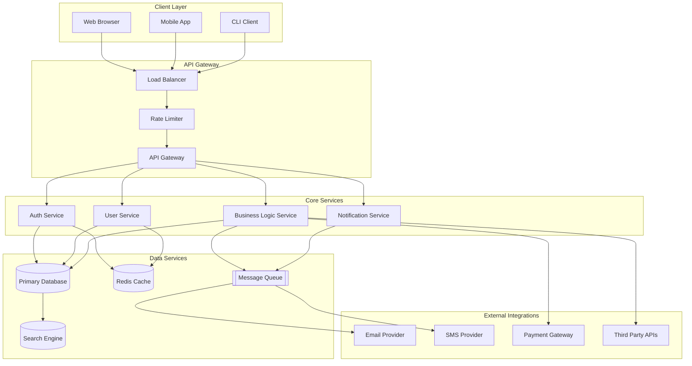
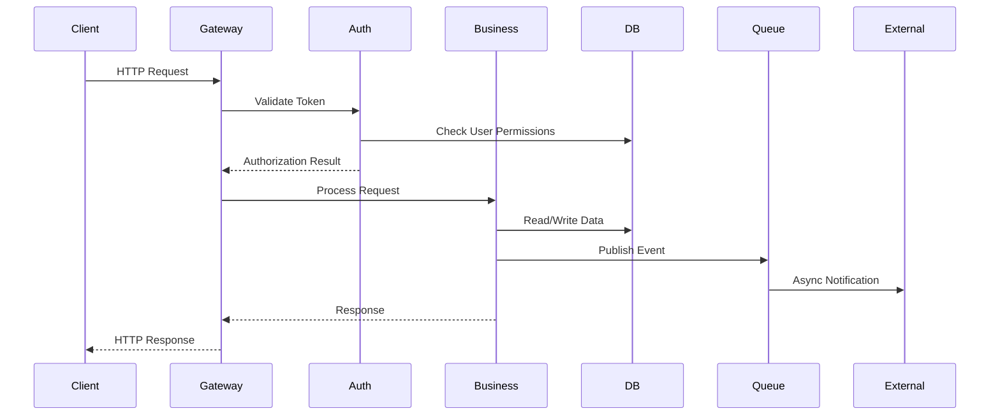

Act as a Systems Architect producing a high-level architectural map from a static code scan.

Output target: `01_Architecture_and_Interactions.md`

Goal:
- Describe main components/services and their interactions (medium length, skimmable and specific).
- Include a Mermaid diagram capturing components and external dependencies.

Method:
- Inspect folder boundaries, package manifests, Docker/K8s, IaC, and configs.
- Identify inbound/outbound integrations (DBs, queues, APIs, 3rd parties).
- Consume GlobalSummary (if available) from `00_Project_Overview.md` to set scope and domain language.

Cross-document data contracts:
- Consumes:
  - GlobalSummary and DocumentPreviews from `00_Project_Overview.md`.
  - PathAnnotations from `03_File_Structure_Guide.md` (if available).
- Exports:
  - ComponentList: array of components with responsibilities and evidence.
  - ExternalDependencies: databases, queues, third parties with access directions.
  - DiagramModel: list of nodes and edges to reuse in later docs.

Return format (Markdown):
### Overview
- 2-3 bullets summarizing the architecture style (monolith, microservices, modular repo)

### Components
- List each major component with a 1-2 line description and evidence paths.

### External Dependencies
- Databases, caches, queues, identity providers, third-party APIs (with evidence).

### System Architecture Diagram

### Component Interactions Flow

Edge cases and guidance:
- If boundaries between components are unclear, group by deployment unit or ownership.
- If multiple integration mechanisms exist (HTTP + gRPC), note both and identify primary path.
- If a service is referenced but absent, mark as External (Unknown implementation) and continue.

Constraints:
- Favor clarity over completeness; avoid speculative details.
- If unknown, label as Unknown.
- Use Mermaid diagrams where it becomes useful/necessary.

