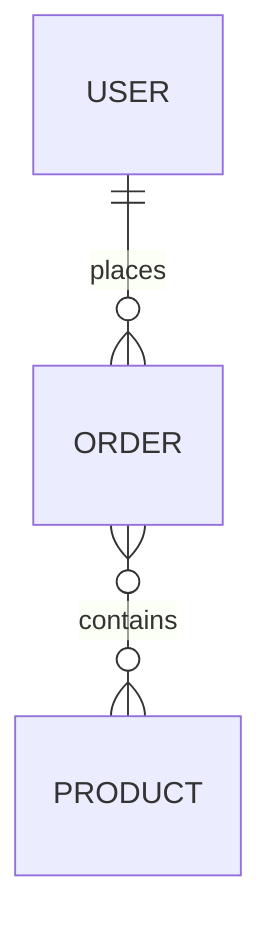

Act as a Data Model Analyst. Generate `02_Data_Model_Schema.md` describing core entities and relationships in medium detail.

Scope:
- Parse ORM models, schema migrations, SQL files, protobufs/Avro (if any), and validation schemas.
- Consume ComponentList/ExternalDependencies from Architecture to map data stores to services.

Cross-document data contracts:
- Consumes:
  - ComponentList and ExternalDependencies from `01_Architecture_and_Interactions.md` (if available).
- Exports:
  - Entities: list with names, fields, types, constraints, sample evidence.
  - Relationships: list with cardinalities, join keys, ownership.

Return format (Markdown):
### Schema Summary
- For each entity/table: name, key fields, important columns with types and constraints (evidence).

### Relationships
- Describe one-to-one/one-to-many/many-to-many relations with direction and cardinality.

### ER Diagram

Edge cases and guidance:
- If the project uses multiple data stores (SQL + NoSQL), separate sections and note cross-store links at the conceptual level.
- If fields are inferred only from validators/DTOs, clearly label as Derived from validation.
- If migrations exist without models (or vice versa), prefer migrations as source of truth.
- Mark Unknown when not derivable.

