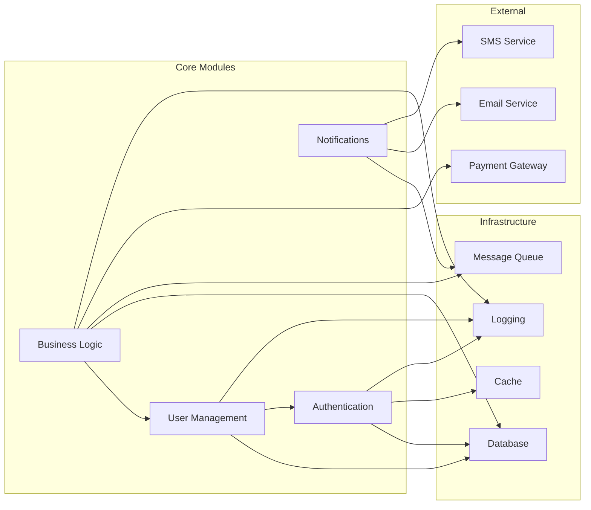

Act as a Repository Navigator. Produce `03_File_Structure_Guide.md` explaining layout and purpose of top-level directories with medium detail.

Method:
- Walk directory tree (depth 2-3 recommended). Identify conventional folders (src, apps, services, packages, infra, scripts).
- Consume GlobalSummary from `00_Project_Overview.md` to tune descriptions with domain language.

Cross-document data contracts:
- Consumes: GlobalSummary from `00_Project_Overview.md`.
- Exports: PathAnnotations map (path -> purpose, notable files) for use by Architecture and Key Components.

Return format (Markdown):
### Repository Tree
```
<rendered tree with brief annotations>
```

### Repository Structure Overview

```mermaid
graph TD
    ROOT[Repository Root] --> SRC[src/]
    ROOT --> DOCS[docs/]
    ROOT --> TESTS[tests/]
    ROOT --> CONFIG[config/]
    ROOT --> SCRIPTS[scripts/]
    ROOT --> INFRA[infrastructure/]
    
    SRC --> API[api/]
    SRC --> WEB[web/]
    SRC --> MOBILE[mobile/]
    SRC --> SHARED[shared/]
    
    API --> CONTROLLERS[controllers/]
    API --> SERVICES[services/]
    API --> MODELS[models/]
    API --> MIDDLEWARE[middleware/]
    
    WEB --> COMPONENTS[components/]
    WEB --> PAGES[pages/]
    WEB --> UTILS[utils/]
    WEB --> STYLES[styles/]
    
    DOCS --> ARCHITECTURE[architecture/]
    DOCS --> API_DOCS[api-docs/]
    DOCS --> DEPLOYMENT[deployment/]
    
    TESTS --> UNIT[unit/]
    TESTS --> INTEGRATION[integration/]
    TESTS --> E2E[e2e/]
    
    CONFIG --> DEV[development/]
    CONFIG --> PROD[production/]
    CONFIG --> TEST[testing/]
    
    SCRIPTS --> BUILD[build/]
    SCRIPTS --> DEPLOY[deploy/]
    SCRIPTS --> UTILS[utils/]
    
    INFRA --> DOCKER[docker/]
    INFRA --> K8S[kubernetes/]
    INFRA --> TERRAFORM[terraform/]
```


### Directory Annotations
- `path/` — 1-2 line description with notable files.

### Module Dependencies


Edge cases and guidance:
- Avoid listing `node_modules/`, build outputs, or vendored dependencies.
- If monorepo, distinguish apps/packages/workspaces and link to their own trees.
- If generated code directories exist, clearly label them as Generated, not edited by hand.
- Use concise bullet notes; point to key files for evidence.
- Use Mermaid diagrams where it becomes useful/necessary.

