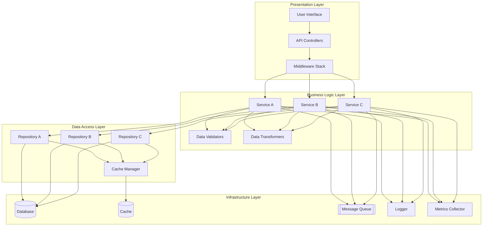
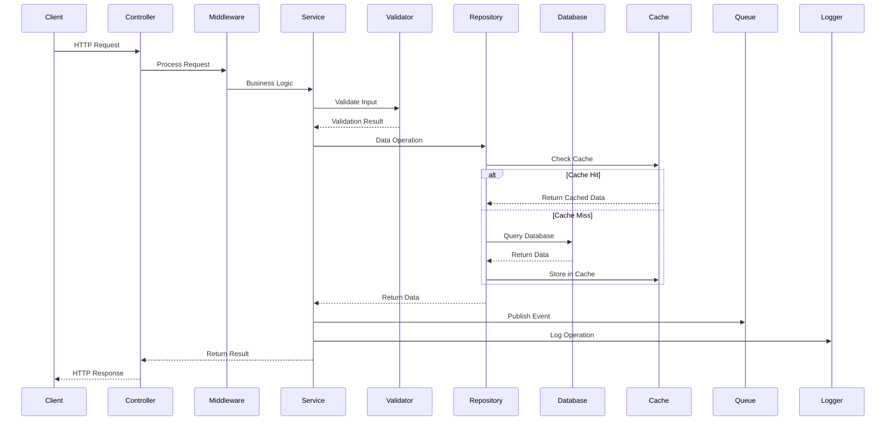

Act as a Principal Engineer. Generate `04_Key_Components_and_Logic.md` summarizing 2-3 most critical modules and their business logic with medium depth.

Selection Criteria:
- Files/services referenced often, core entrypoints, controllers, domain services, critical jobs.
- Consume ComponentList and PathAnnotations to prioritize real critical paths.

Cross-document data contracts:
- Consumes:
  - ComponentList from `01_Architecture_and_Interactions.md` (if available)
  - PathAnnotations from `03_File_Structure_Guide.md`
- Exports:
  - KeyComponents: list of components with responsibilities, key functions/classes, and side effects.

For each component:
- Purpose (2-3 sentences)
- Key functions/classes and their responsibilities
- Important inputs/outputs and side effects
- Evidence: file paths and brief code cues

### Component Architecture Diagram

### Component Interaction Sequence

Edge cases and guidance:
- If responsibilities overlap across modules, call out cohesion/coupling explicitly.
- If a component is a façade around external SDKs, document the abstraction boundary and error handling.
- Prefer code entrypoints (CLI, HTTP handlers, schedulers) to drive the narrative.

Constraints:
- Be selective; depth over breadth.
- No speculative behavior; cite code hints.
- Use Mermaid diagrams where it becomes useful/necessary.

