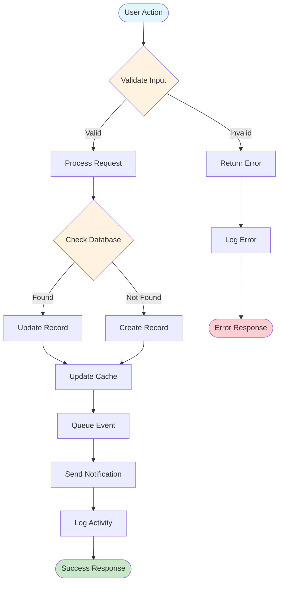
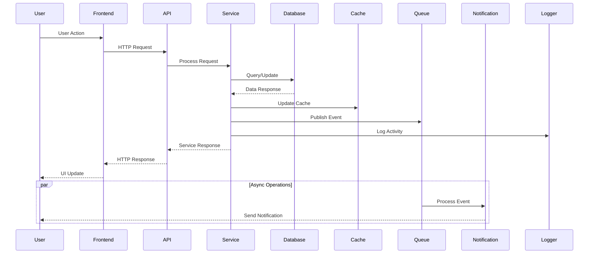

Act as a System Analyst. Produce `05_Data_Flows.md` describing one primary end-to-end data journey with medium detail.

Candidate flows:
- User registration/login, order processing, ingestion pipeline, scheduled job lifecycle.
- Consume KeyComponents and (if available) early summaries from API Endpoints and Data Model to ground steps.

Cross-document data contracts:
- Consumes:
  - KeyComponents from `04_Key_Components_and_Logic.md`.
  - Entities/Relationships from `02_Data_Model_Schema.md` (if available).
  - Endpoint list from `06_API_Endpoints.md` (if available; otherwise derive from controllers/routes).
- Exports:
  - PrimaryFlow: name, trigger, ordered steps with actors, inputs, outputs, side effects.

Return format (Markdown):
### Flow Name
### Trigger
### Steps (numbered)
- Step n: Actor, operation, inputs, outputs, side effects, evidence paths

### Data Flow Diagram

### End-to-End Sequence Flow

### Notes & Edge Cases
- Timeouts, retries, failure handling, idempotency (if present in code)

Edge cases and guidance:
- If multiple plausible primary flows exist, choose the one with the broadest coverage of components and data.
- If error handling is implicit (try/catch without branches), document typical failure modes inferred from logs or messages.
- If asynchronous steps exist (queues, schedulers), separate synchronous vs asynchronous paths.
- Use Mermaid diagrams where it becomes useful/necessary.

