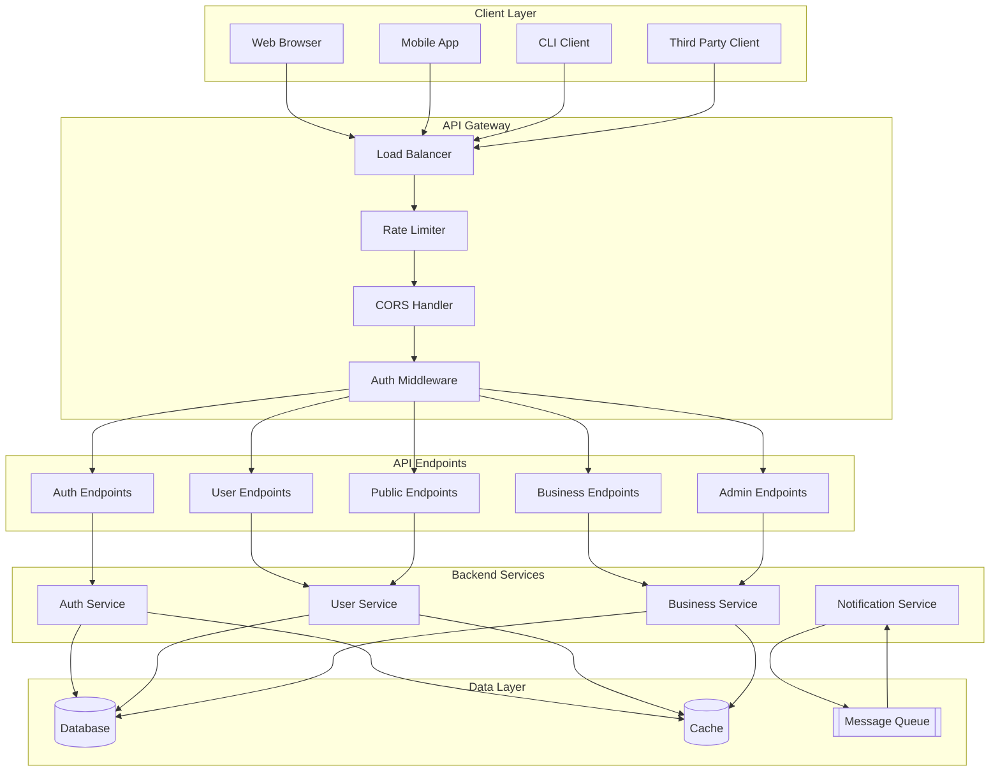
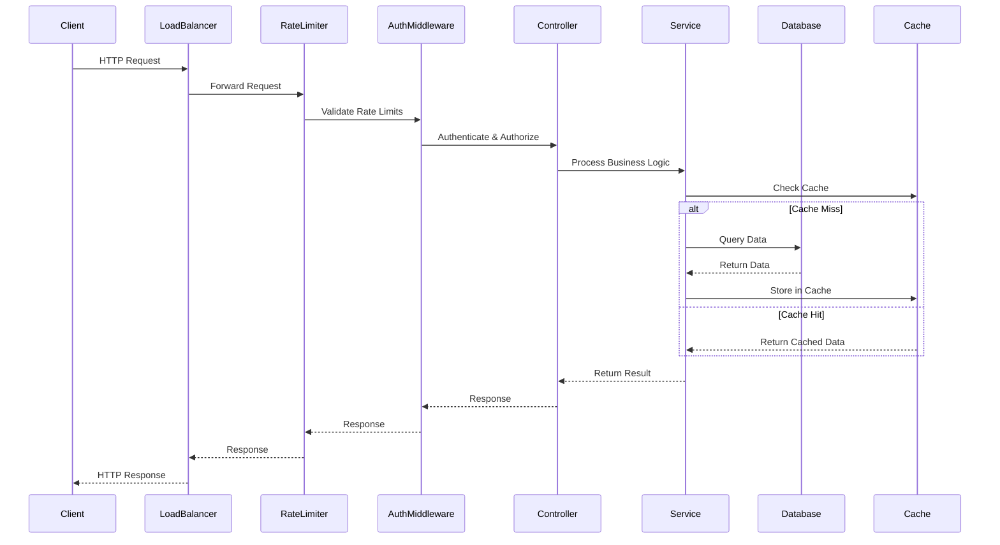

Act as an API Documentation Analyst. Generate `06_API_Endpoints.md` cataloging all discovered HTTP/gRPC endpoints with medium detail.

Goal:
- List routes with method, purpose, request/response shape, auth, and notable errors, with evidence-backed notes.

Method:
- Parse route definitions (e.g., Express/FastAPI/Spring annotations), OpenAPI/Swagger files, API gateway configs, controllers, and tests.
- Derive input/output schemas from validators/DTOs/serializers when available.
- Consume GlobalSummary from `00_Project_Overview.md` to align endpoint descriptions with domain language.

Cross-document data contracts:
- Consumes:
  - GlobalSummary from `00_Project_Overview.md`.
  - Entities from `02_Data_Model_Schema.md` (if available) to note key IDs and resource relationships.
  - ComponentList from `01_Architecture_and_Interactions.md` to map endpoints to components.
- Exports:
  - EndpointList: path, method, purpose, request schema, response schema, auth, errors, handler path.

Return format (Markdown):
### Summary
- Framework(s) and discovery sources

### Endpoints
| Path | Method | Purpose | Request (schema) | Response (schema) | Auth | Errors |
|---|---|---|---|---|---|---|
| /example | GET | Short description | Query: ... Body: ... | 200: ... | e.g., JWT | 400, 401, 404 |

### API Architecture Overview

### API Request Flow

### Notes
- Pagination, rate limits, idempotency, versioning (if present)

Edge cases and guidance:
- If multiple routers/frameworks coexist (e.g., REST + gRPC), create separate subsections.
- If request/response schemas are implicit, infer from validators/DTOs and label as Derived.
- If auth is enforced by middleware, document at middleware and endpoint levels.
- If versioning is path-based vs header-based, state the strategy and default.

Constraints:
- Prefer evidence-backed details. Mark Unknown when not derivable.
- Use Mermaid diagrams where it becomes useful/necessary.

