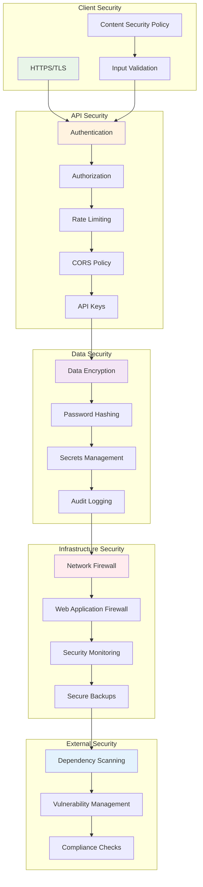
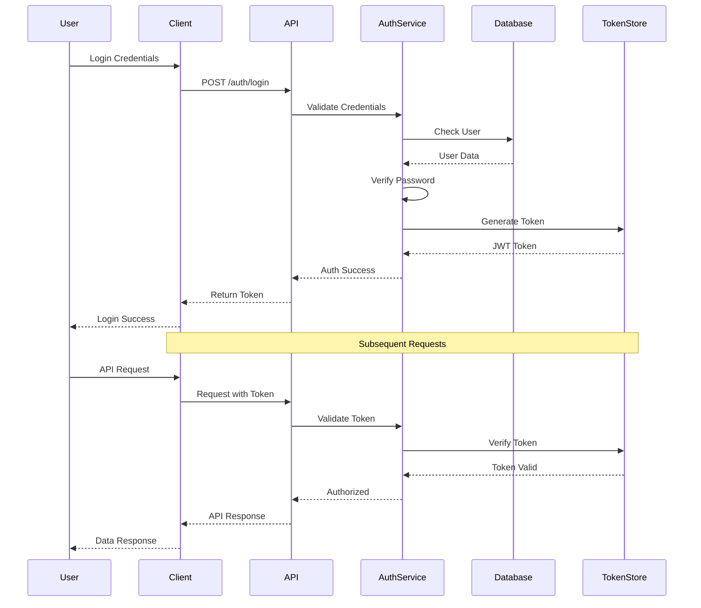

Act as a Security Analyst. Produce `07_Security_Overview.md` summarizing security mechanisms and considerations with medium depth.

Scope:
- Authentication & Authorization models, Secrets management, Data protection, Input validation, Dependency security, Network/CORS, Audit logging.

Evidence:
- App code, configs, CI pipelines, Docker/K8s, IaC (Terraform/CloudFormation), security tools (Snyk, Dependabot), reverse proxies.

Cross-document data contracts:
- Consumes:
  - EndpointList from `06_API_Endpoints.md` to reason about authZ and rate limiting.
  - DependencyList and EnvVarTable from `08_Dependencies_and_Environment.md`.
  - DiagramModel/ExternalDependencies from `01_Architecture_and_Interactions.md`.
- Exports:
  - SecurityFindings: list of controls, assumptions, gaps, and mitigations.

Return format (Markdown):
### Authentication & Authorization
- Mechanisms, providers, token lifetimes, roles/permissions (evidence)

### Secrets Management
- Storage, rotation, injection (e.g., env vars, vaults) (evidence)

### Data Protection
- Encryption at rest/in transit, PII handling (evidence)

### Input Validation & Hardening
- Validation libs, sanitization, rate limiting, security headers, CORS

### Dependency & Supply Chain Security
- Lockfiles, scanners, update policies

### Audit & Monitoring
- Audit logs, anomaly detection, alerting

### Security Architecture

### Authentication Flow

### Risks & Mitigations
- Known risks from code/config and current mitigations

Constraints:
- Be precise; if uncertain, state Unknown. No speculation.
- Use Mermaid diagrams where it becomes useful/necessary.

Edge cases and guidance:
- If secrets are present in code, flag explicitly and recommend relocation to a secret manager.
- If CORS is permissive (`*`), note implications and intended environments.
- If TLS termination is external (e.g., at ingress/proxy), clarify where encryption in transit is enforced.
- If third-party SDKs handle auth (Firebase/Cognito/NextAuth), link boundary and session storage behaviors.

