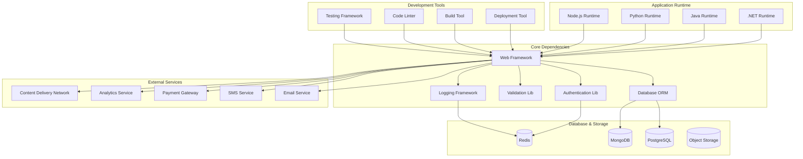
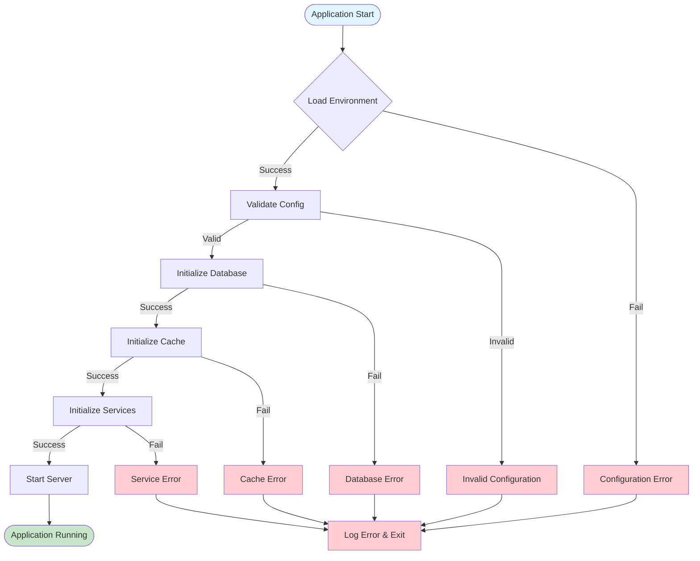

Act as a DevOps Engineer. Generate `08_Dependencies_and_Environment.md` listing external requirements and environment with medium detail.

Evidence sources:
- Manifests (`package.json`, `requirements.txt`, `pom.xml`), Dockerfiles, docker-compose, Makefiles, `.env*`, CI configs, scripts.

Cross-document data contracts:
- Consumes: GlobalSummary from `00_Project_Overview.md`.
- Exports:
  - DependencyList: runtimes, CLIs, services with versions and evidence.
  - EnvVarTable: normalized environment variable table for reuse downstream.

Return format (Markdown):
### Software Dependencies
- Runtime (language versions), CLIs, databases, queues, caches, browsers, etc. (with evidence)

### Environment Variables
| Name | Required | Default | Description | Source |
|---|---:|---|---|---|
| EXAMPLE_VAR | Yes | - | What it does | .env.example |

### External Services
- Third-party APIs, credentials, endpoints (non-secret details only)

### Ports & Networking
- Local ports, service URLs, CORS origins

### Dependencies Architecture

### Environment Configuration Flow

Constraints:
- Do not include secrets. Mark Unknown where applicable.
- Use Mermaid diagrams where it becomes useful/necessary.

Edge cases and guidance:
- If `.env.example` is missing but variables are referenced in code/compose, infer and mark Derived.
- If version pins are absent, state minimum observed versions from lockfiles/engines.
- If optional services exist (feature-flagged), mark as Optional and note conditions.

