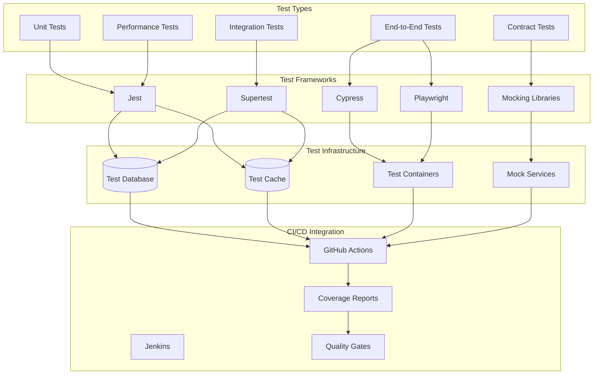
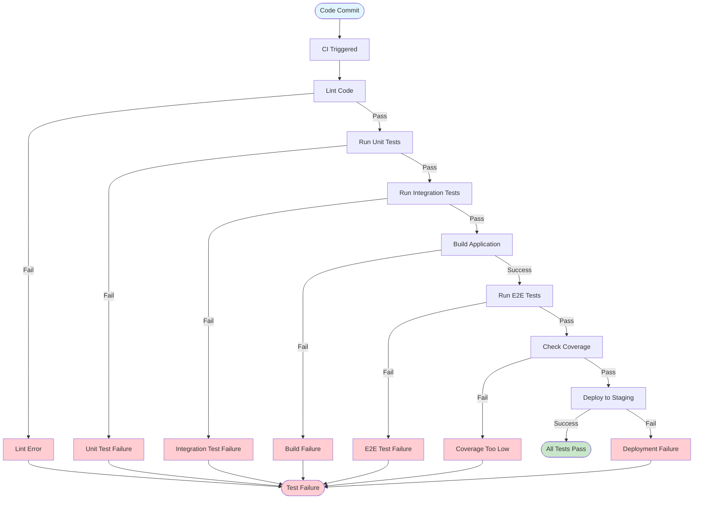

Act as a Test Engineer. Produce `09_Testing_Strategy.md` outlining how tests are organized and executed with medium depth.

Evidence:
- Test directories, config files (jest.config, pytest.ini, junit.xml), CI jobs, coverage reports, mocks.

Cross-document data contracts:
- Consumes:
  - EndpointList from `06_API_Endpoints.md` for e2e/contract mappings.
  - DependencyList from `08_Dependencies_and_Environment.md` for local test services.
- Exports:
  - TestCommands: canonical commands to run tests locally and in CI.

Return format (Markdown):
### Test Types & Scope
- Unit, integration, e2e, contract, performance (which exist and where)

### Frameworks & Tools
- Libraries, runners, assertion/mocking tools (evidence)

### Running Tests
```bash
# Commands discovered (prefer package scripts / make targets)
```

### Coverage & Quality Gates
- Coverage tools/thresholds, linters/type checks enforced in CI

### Notable Fixtures & Test Data
- Seeds, factories, sandboxing approaches

### Testing Architecture


### Testing Workflow


Constraints:
- Cite evidence; mark Unknown if absent.
- Use Mermaid diagrams where it becomes useful/necessary.

Edge cases and guidance:
- If tests are colocated with code, document glob patterns and coverage collection.
- If CI uses a different command than local, list both and explain differences (e.g., flags, reporters).
- If fixtures require services (DB/Redis), show how tests provision or mock them.

