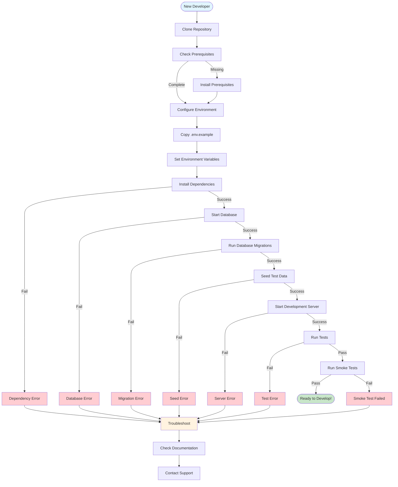
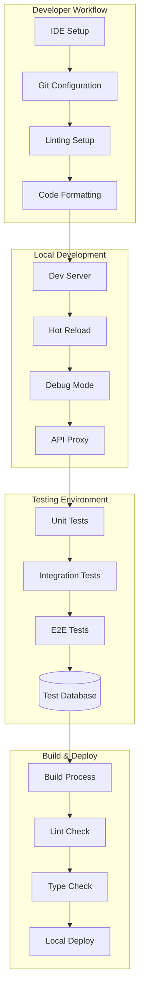

Act as a Developer Onboarding Writer. Create `10_Developer_Onboarding_Guide.md` with actionable steps to run locally, at medium detail.

Return format (Markdown):
### Prerequisites
- Languages, runtimes, CLIs, services with versions and install links (evidence)

### Setup
1. Clone and configure environment variables
2. Install dependencies
3. Start dependent services (DB/queues)
4. Initialize database/seed data

### Run the Application
```bash
# Commands to launch dev server(s)
```

### Smoke Test
- Steps to confirm the app is working (URLs, sample requests)

### Troubleshooting
- Common issues and fixes inferred from scripts/README/CI

### Development Environment Setup Flow


### Project Structure Overview


Constraints:
- Prefer simple step-by-step commands. Mark Unknown where needed.
- Use Mermaid diagrams where it becomes useful/necessary.

Cross-document data contracts:
- Consumes:
  - EnvVarTable and DependencyList from `08_Dependencies_and_Environment.md`.
  - EndpointList from `06_API_Endpoints.md` for smoke tests.
  - TestCommands from `09_Testing_Strategy.md` for validating setup.
- Exports:
  - OnboardingSteps: canonical setup and run steps for reuse in deployment docs.

Edge cases and guidance:
- If multiple apps/services exist, provide per-service setup sections and a top-level orchestrated path (docker-compose or scripts).
- If seed data is optional or destructive, call that out and provide safe defaults.
- If hot reload/auto-restart is available, document the dev experience expectations.

